# Wealth and Population Density Influences on COVID-19 Cases, Deaths, and Vaccinations Using Machine Learning
by Ken Noppinger

## Introduction
This research investigates the influence that wealth and population density have had on the COVID-19 pandemic in the United States. 

Since March 2020, the COVID-19 virus has raged through the US and around the world. To date, there are over 175 million cases worldwide and approaching 35 million cases within the US alone. The US death toll is over 600 thousand.  Health organizations have placed a significant emphasis on social distancing and wearing masks to prevent virus spread through airborn droplets.  Federal and state governments put lockdowns in place and after a year have only recently lifted lockdowns as vaccines have become available and the population is approaching herd immunity.  

The goal of this study is to use machine learning on US county data with a focus on uncovering possible correlations of wealth and population density relative to the virus cases, deaths, and vaccinations.

## Hypothesis / Research Question(s)
The study will serve to answer the following questions:

  1.  Have wealthy counties been impacted differently by COVID-19?
  2.  Has county population density played a role in COVID-19? 
  3.  Have county wealth and population density together influenced COVID-19 infections, deaths, and vaccinations?

## Unit of Analysis
US County is the unit of analysis for this research.  

This unit is represented in the data by the FIPS code

* 5-digit Federal Information Processing Standards (FIPS) code uniquely identifying counties and county equivalents in the United States.  
* Data sets are joined using the FIPS code (with corresponding county names)
* Used to group data features such as population density, income, COVID cases, deaths, and vaccinations during analysis and machine learning.

## Data Sets

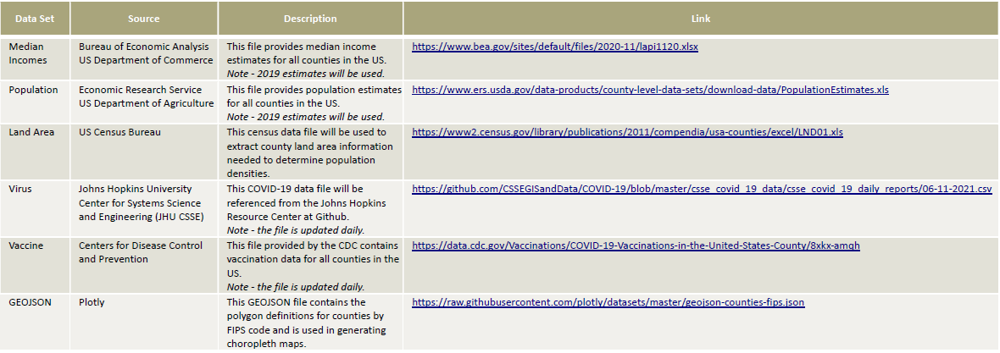

## Merging Data Set Strategy

1. Population and Land Area Data are merged on FIPS code column
2. Vaccine Data merged with Median Incomes Data on County column
3. Results from 1 & 2 merged with each other on FIPS code column
4. Results from 3 merged with Virus Data on FIPS code column

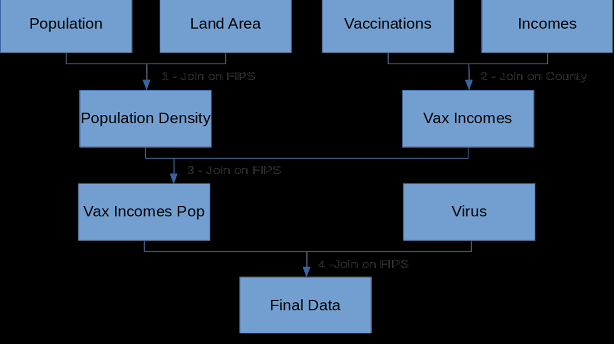

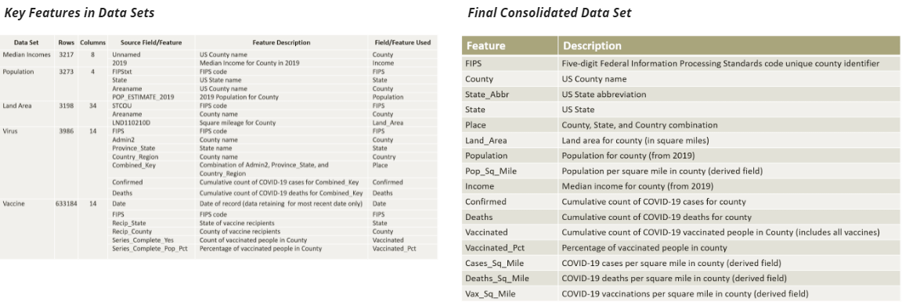
  
## Implementation (Model)
Of the variety of machine learning techniques, clustering is widely used for revealing structures in data as it works for both labelled and unlabeled data. The special feature of clustering is that it works very well on datasets where simple relationships among data items is unknown.  This aspect makes clustering an ideal choice for modeling the data for this study. 

There are various clustering algorithms available but simple k-Means Centroid-based clustering will be used for this study.  Centroid-based clustering organizes the data into non-hierarchical clusters and it uses a Euclidian distance based clustering mechanism.  This method is typically faster than other clustering techniques.  

Basic k-Means Machine Learning Implementation[1]:
1.  Select k points at random as centroids.
2.  Assign data points to the closest cluster based on Euclidean distance
3.  Calculate centroid of all points within the cluster
4.  Repeat these steps iteratively until convergence.

The elbow method will be used to determine the optimal number of clusters.  To do this, the k means implementation will be executed for multiple k values and plotted against the sum of squared distances from the centroid (loss function)[1].  The elbow of the curve is where the curve visibly bends and this will be selected as the optimum k.

The process above will be applied first to income data, then population data, and the various COVID data.  Combinations of the data will then be attempted to glean knowledge from consolidated data clusterings.

## Exploratory Data Analysis

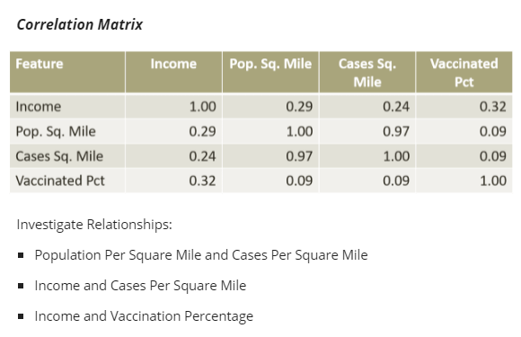

Over 3000 counties plots too many points and not ideal for clustering.  Pick a sample of states to study.

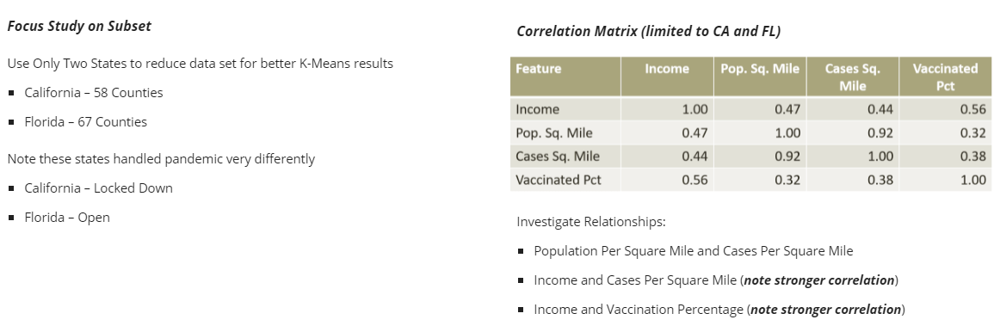

## K-Means Model Execution

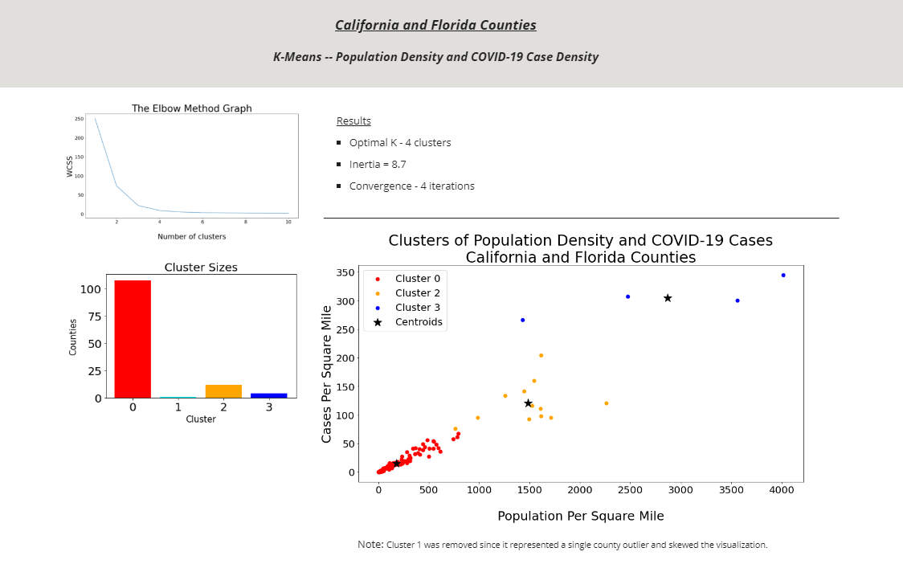

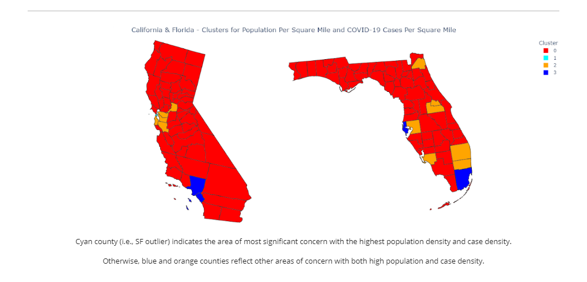

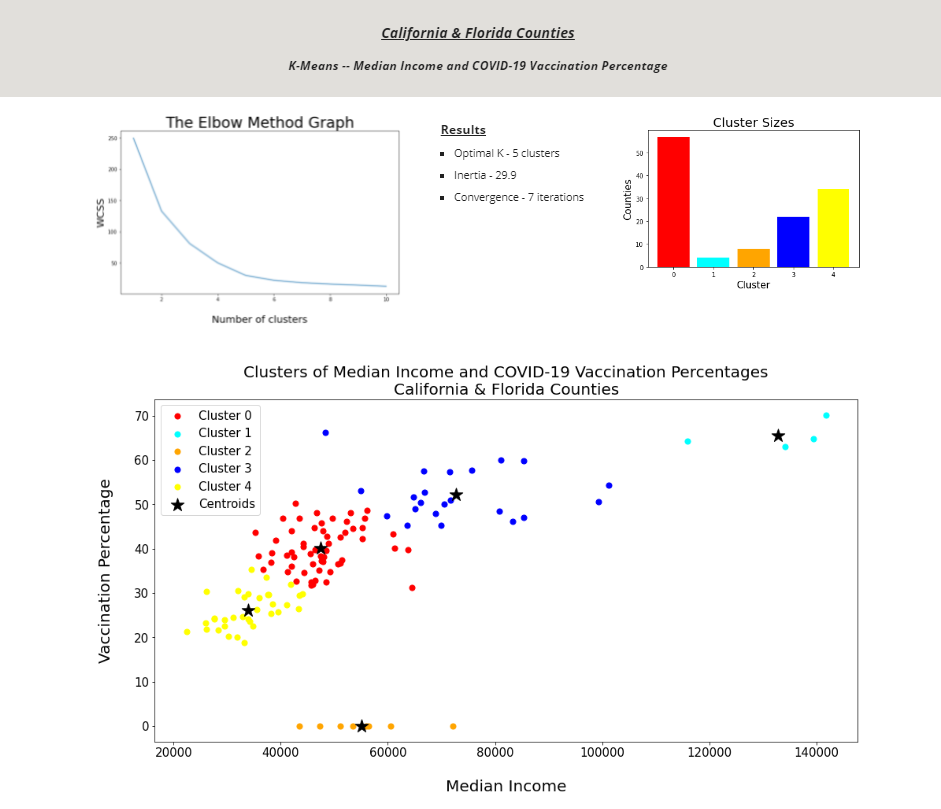

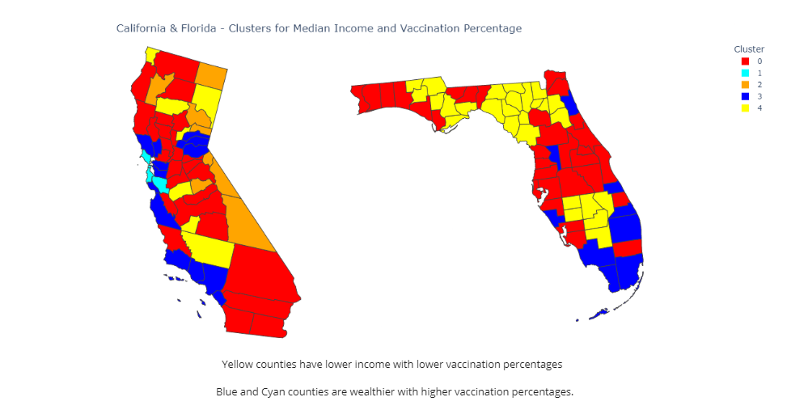

The K-Means model execution demonstrated clustering relationships of population density and case density as well as median income and vaccination percentages at the county level for the states of California and Florida.  The clustering results appear to answer the key hypothesis questions in that wealthy counties have demonstrated higher vaccination percentages and population density is a strong driver for case density.  It remains a question if the clustering results for these two states would be a fair representation at a national level.  Initially, the stretch goal was to train a supervised model and predict clusters for counties.  However, this type of assumption could be significantly flawed if the California and Florida clusters aren't a good representation of the nation as a whole.  

An alternative is to look at the clustering of the select features in regional areas of the country by grouping states.  To allow for this flexibility in analysis, an interactive web page has been created to allow a researcher to select any two features in the dataset to cluster using K-Means, plot the clusters, and display a choropleth cluster map.

### K-Means Web Application 

https://knoppin1.pythonanywhere.com  (☚ TRY ME)

-------------------

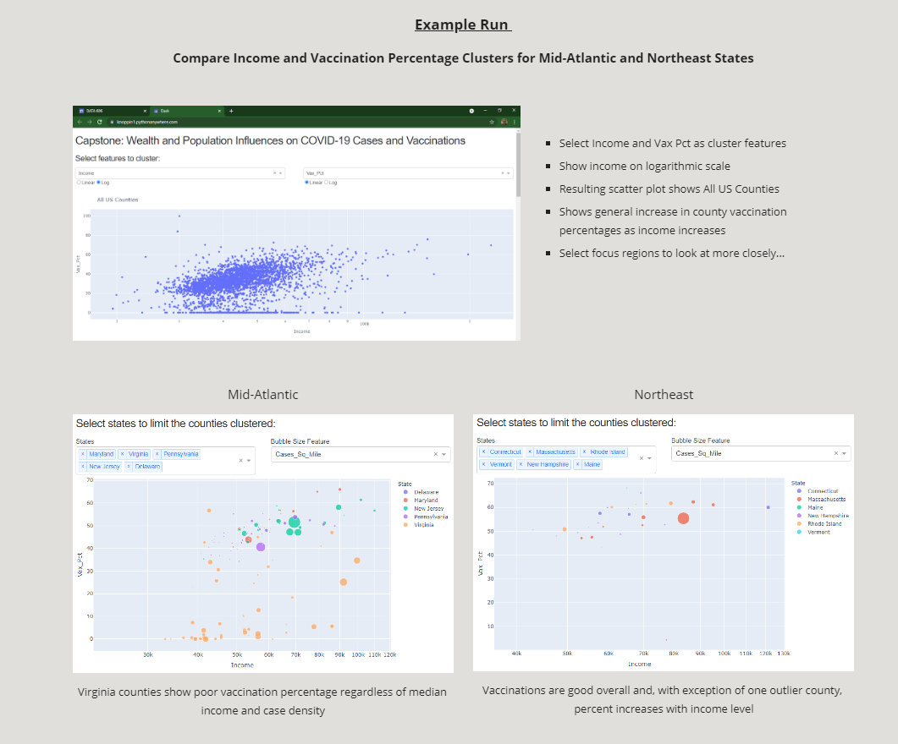

-------------------

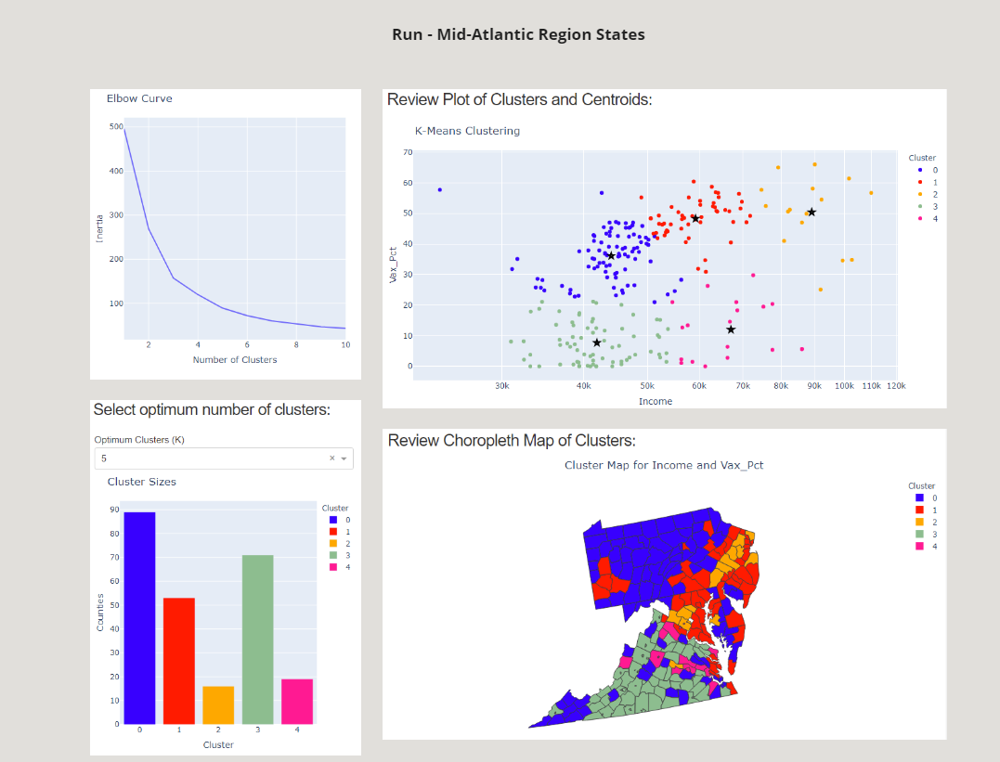

#### Cluster Analysis
* Cluster 0 - represents low to mid income counties with vaccinated population between 20% and 50%
* Cluster 1 - represents mid to upper income counties with vaccinated population mostly in 40% to 60% range
* Cluster 2 - represents upper income counties with centroid vaccinated population at 50% (note some outliers at less)
* Cluster 3 - represents low to mid income counties with vaccinated population below 20%
* Cluster 4 - represents mid to upper income counties with vaccinated population below 40% (centroid a little over 10%)

#### Run Interpretation 
* Clusters 3 and 4 should be the focus area for enhanced vaccination efforts / these are the more rural counties in VA
* Choropleth shows I-95 corridor counties from northern VA through NJ have highest income and vaccination percentages

-------------------

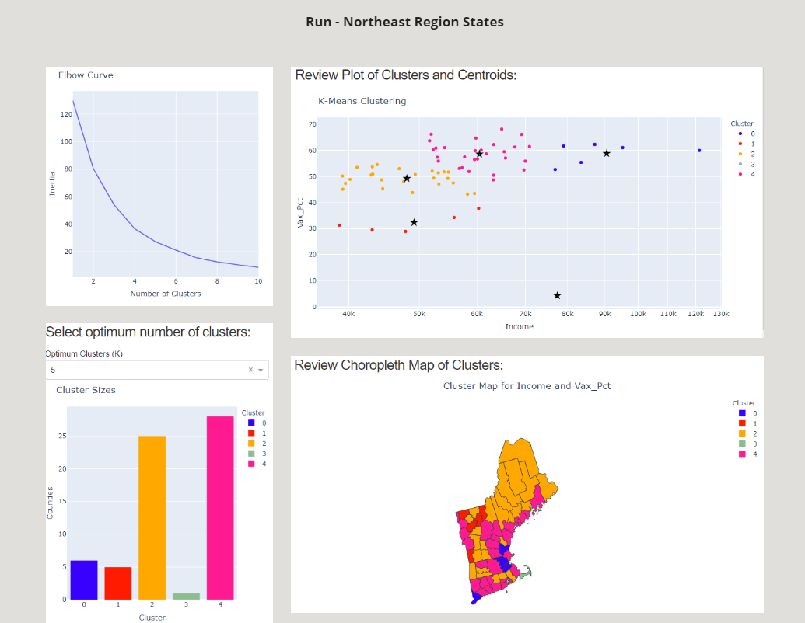

#### Cluster Analysis
* Cluster 0 - represents upper income counties with vaccinated population above 50% 
* Cluster 1 - represents low to mid income counties with vaccinated population between 30% and 40%
* Cluster 2 - represents low to mid income counties with vaccinated population between 40% and 55%
* Cluster 3 - represents an outlier county in Massachusetts with high income, low vaccination percentage, and case density
* Cluster 4 - represents mid to upper income counties with vaccinated population between 50% and 70%

#### Run Interpretation 
* Cluster 1 counties should be focus area for enhanced vaccination efforts 
* Choropleth shows Cluster 1 concentrated in northern Vermont
* Choropleth shows inland Maine counties highly represented in Cluster 2, which also would benefit from enhanced vaccination efforts

-------------------
### Interpretations and Conclusions

Returning to the hypothesis questions the following findings surfaced from this study:

1. Have wealthy counties been impacted differently by COVID-19?

   Both the correlation and the clustering did not reflect wealth having impact on COVID-19 case density.  However, county wealth does appear to impact the vaccination percentage of the population.  The K-Means clustering runs show that both the scaling and the cluster meanings will vary in different regions of the country.  This was demonstrated with the K-Means web application in the section above.

2. Has county population density played a role in COVID-19? 

   The K-Means clustering reflected the strong linear correlation of population density and COVID-19 case density.  Basically, the study shows case density increases with higher county population density.  Population density (actually used case density) did not appear as a major influencing factor in the bubble charting showing the affect of wealth on vaccination percentage.

3. Have county wealth and population density together influenced COVID-19 infections and vaccinations?

   This question was not answered directly through a K-Means clustering as part of this study and was left as a future exercise.  An enhancement could be made to the K-Means web application to allow selection of three features from the data set.  Scenarios to investigate would be clustering on population density, median income, and case density as well as population density, median income, and vaccination percentage.

An overall takeaway from this study is that K-Means clustering proved useful to group counties having similar attributes regarding the features studied in the dataset (i.e., median income, population, cases, vaccinations, density, etc.).  It became apparent after crafting many Jupyter notebooks that the need for dynamic clustering and selection of these features to address specific questions is valuable.  

The development of the K-Means web application provided the flexible platform for completing the analysis and machine learning steps needed for this study.  This tool has value beyond the study and could be used to address "what if" scenarios benefiting public health workers as they react to changes in the COVID-19 cases and vaccinations throughout the pandemic.

-------------------

## References
1. Abdullah D;Susilo S;Ahmar AS;Rusli R;Hidayat R; “The Application of K-Means Clustering for Province Clustering in Indonesia of the Risk of the COVID-19 Pandemic Based on COVID-19 Data.” Quality & Quantity, U.S. National Library of Medicine, https://pubmed.ncbi.nlm.nih.gov/34103768. 
2. Sengupta, Pooja, et al. “An Analysis of COVID-19 Clusters in India.” BMC Public Health, BioMed Central, 31 Mar. 2021, https://bmcpublichealth.biomedcentral.com/articles/10.1186/s12889-021-10491-8. 
3. Wu J, Sha S. Pattern Recognition of the COVID-19 Pandemic in the United States: Implications for Disease Mitigation. International Journal of Environmental Research and Public Health. 2021 Mar;18(5). DOI: 10.3390/ijerph18052493.
4. alifia2. “Centroid Based Clustering : A Simple Guide with Python Code.” Analytics Vidhya, 27 Jan. 2021, www.analyticsvidhya.com/blog/2021/01/a-simple-guide-to-centroid-based-clustering-with-python-code/. 
5. Girgin, Samet. “K-Means Clustering Model in 6 Steps with Python.” Medium, PursuitData, 26 July 2020, https://medium.com/pursuitnotes/k-means-clustering-model-in-6-steps-with-python-35b532cfa8ad. 
6. “Use Sklearn StandardScaler() Only on Certain Feature Columns.” ThiscodeWorks, www.thiscodeworks.com/use-sklearn-standardscaler-only-on-certain-feature-columns-python/605cc55c3c8db10014203c0e.
